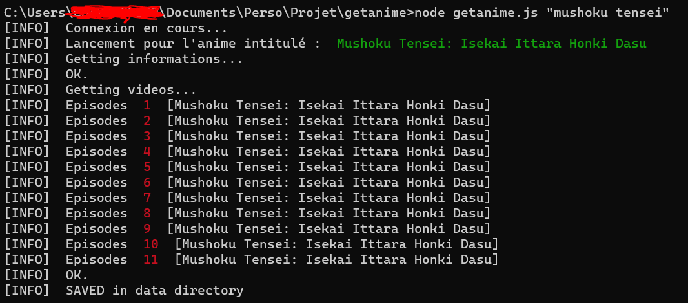
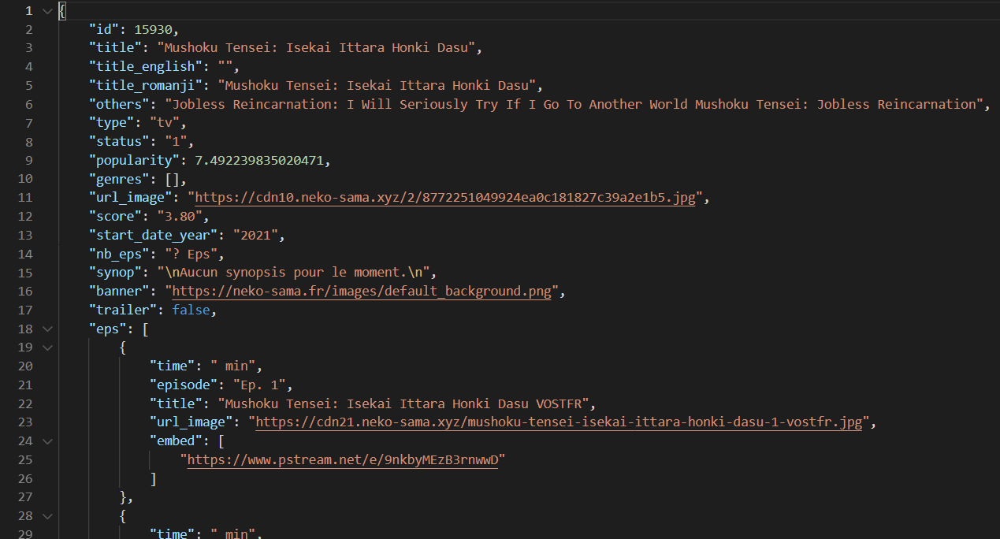

# Getanime.js v1.0.0
Get any anime informations with embed video, trailer, images, synopsys ...

## To install
```
npm i dom-parser
npm i cloudscraper
npm i request
npm i request-promise-core
```

## How to use ?
---
USAGE:
- node getanime.js "hunter x hunter" - to get the anime json file in structured mode
- node getanime.js "hunter x hunter" false - to get the anime json file in not structured mode (minimified file)

## Example




## Lib
To get anime datas we use anime-vostfr api
- https://www.npmjs.com/package/anime-vostfr
- https://github.com/yoannchb-pro/anime-vostfr
